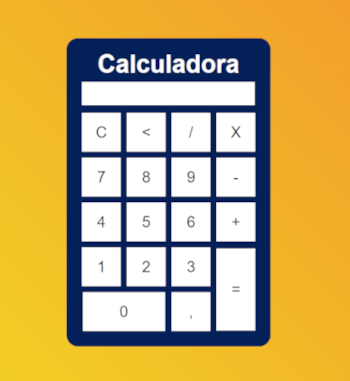

# 🚀 Projetos em Prática

Este repositório contém projetos desenvolvidos com o objetivo de praticar e reforçar os estudos de **HTML** e **CSS**.  
Atualmente, ele inclui:

- 🧮 Uma **Calculadora** para operações básicas
- 📝 Um **Formulário de Cadastro**

---

## 📝 Formulário de Cadastro

Projeto criado utilizando **HTML** e **CSS**, com foco em estruturação de campos de formulário, organização visual e semântica.

📸 *Imagem do projeto abaixo:*  

---

## 🧮 Calculadora

Calculadora básica feita com **HTML** e **CSS**, simulando operações simples: **adição (+), subtração (−), multiplicação (×)** e **divisão (÷)**.

📸 *Imagem do projeto abaixo:*  

---

## 📝 Lâmpada

Projeto criado utilizando **HTML** **CSS** e **JS**, para praticar interação do usuário .

📸 *Imagem do projeto abaixo:*  
*(Adicione aqui um print da tela)*

---

## 📌 Objetivo

Esses projetos têm como foco:
- Aplicar conceitos fundamentais de HTML e CSS
- Aprimorar a organização de código
- Treinar estruturação de interfaces visuais

---

## 🛠️ Tecnologias utilizadas

- HTML5
- CSS3
- JAVASCRIPT

---

Feito com dedicação para fins de estudo e prática.  
Sinta-se à vontade para deixar sugestões ou melhorias!

